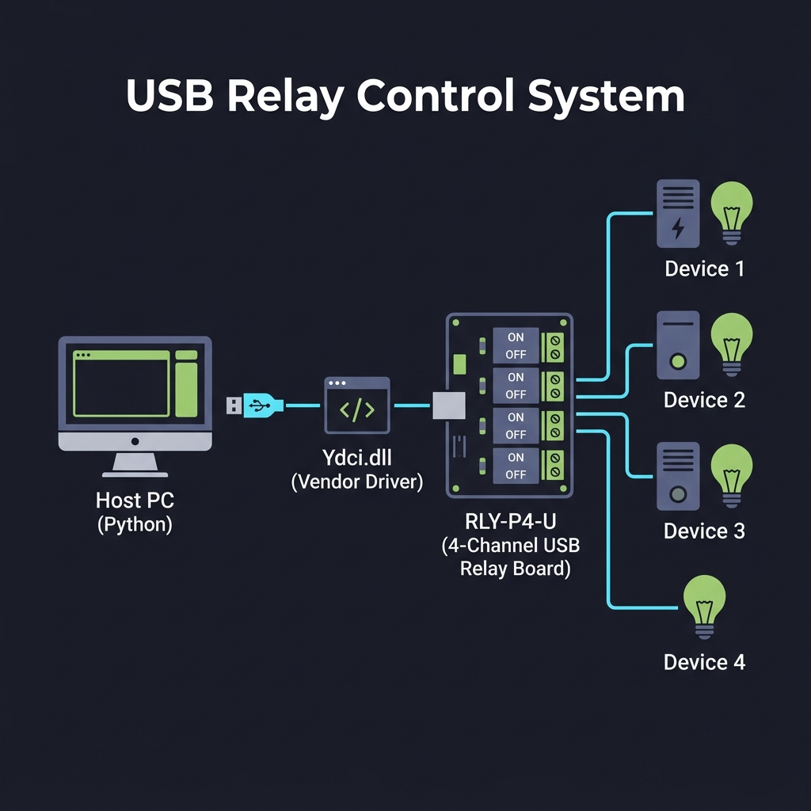
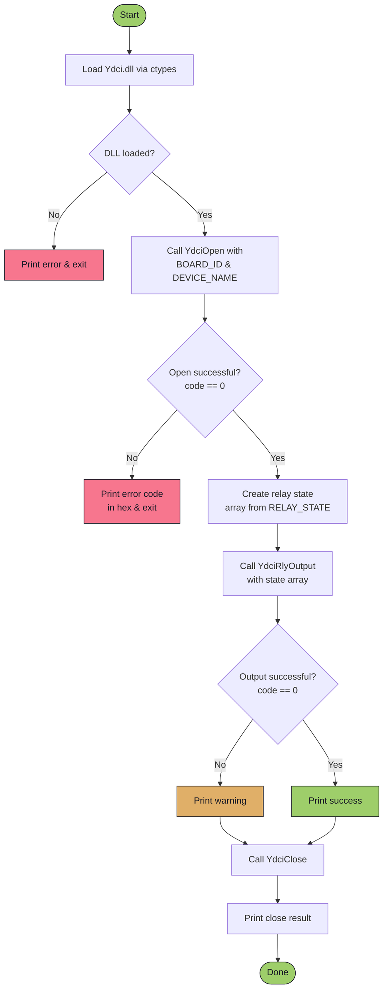

# USB Relay Control System

> **Python-based control software for 4-channel USB relay boards via the Ydci vendor DLL.**



---

## Table of Contents

- [Overview](#overview)
- [System Architecture](#system-architecture)
- [Hardware Requirements](#hardware-requirements)
- [Software Requirements](#software-requirements)
- [Installation](#installation)
- [Configuration](#configuration)
- [Usage](#usage)
- [API Reference](#api-reference)
- [Program Flow](#program-flow)
- [Relay Channel Mapping](#relay-channel-mapping)
- [Error Codes](#error-codes)
- [Troubleshooting](#troubleshooting)
- [License](#license)

---

## Overview

This project provides a Python script (`main.py`) that interfaces with a **RLY-P4-U** 4-channel USB relay board through the vendor-supplied **Ydci.dll** driver library. It uses Python's `ctypes` module to call native DLL functions, enabling programmatic control of relay states (ON/OFF) for each channel.

The system was developed as part of a collaborative research project at **Universitas Gadjah Mada (UGM)**.

---

## System Architecture

The system follows a layered architecture where the Python application communicates with the relay hardware through a vendor-provided DLL:

```
┌─────────────────────────────────────────────────────────────────────┐
│                        HOST PC (Windows)                            │
│                                                                     │
│  ┌──────────────┐     ┌──────────────┐     ┌──────────────────────┐ │
│  │   main.py    │────▶│   ctypes     │────▶│     Ydci.dll         │ │
│  │  (Python)    │     │  (FFI Layer) │     │  (Vendor Driver)     │ │
│  └──────────────┘     └──────────────┘     └──────────┬───────────┘ │
│                                                       │             │
└───────────────────────────────────────────────────────┼─────────────┘
                                                        │ USB
                                                        ▼
                                            ┌───────────────────────┐
                                            │   RLY-P4-U Relay      │
                                            │   Board (4-Channel)   │
                                            ├───────┬───────┬───────┤
                                            │ CH 1  │ CH 2  │ CH 3  │ CH 4
                                            │  ON   │  ON   │  ON   │ OFF
                                            └───┬───┴───┬───┴───┬───┘───┬──
                                                │       │       │       │
                                                ▼       ▼       ▼       ▼
                                            Device 1 Device 2 Device 3 Device 4
```

### Component Breakdown

| Component         | Role                                                                 |
|-------------------|----------------------------------------------------------------------|
| **`main.py`**     | Python script that configures and sends relay commands                |
| **`ctypes`**      | Python's built-in Foreign Function Interface for calling C libraries  |
| **`Ydci.dll`**    | Vendor-supplied driver library (cdecl calling convention)             |
| **USB Interface** | Physical USB connection to the relay board                           |
| **RLY-P4-U**      | 4-channel relay board with DIP-switch for board ID selection          |

---

## Hardware Requirements

| Item                     | Specification                              |
|--------------------------|--------------------------------------------|
| Relay Board              | **RLY-P4-U** (4-channel USB relay module)  |
| USB Port                 | USB 2.0 or higher                          |
| Power                    | USB bus-powered                            |
| Board DIP Switch         | Set to ID `0` (default)                    |

---

## Software Requirements

| Dependency     | Version       | Notes                                      |
|----------------|---------------|--------------------------------------------|
| Python         | 3.7+          | Standard library only — no pip packages     |
| Windows OS     | 10 / 11       | Required for Ydci.dll compatibility         |
| Ydci.dll       | Vendor build  | Must be on `PATH` or in the working directory |

> **Note:** This project uses **only the Python standard library** (`sys`, `ctypes`, `time`). No external packages are required.

---

## Installation

### 1. Clone the Repository

```bash
git clone <repository-url>
cd code
```

### 2. Install the Ydci Driver

1. Connect the **RLY-P4-U** relay board to your PC via USB.
2. Install the vendor-supplied USB driver (typically found on the manufacturer's CD or download page).
3. Ensure `Ydci.dll` is accessible — place it either:
   - In the same directory as `main.py`, **or**
   - In a directory listed in your system `PATH`

### 3. Verify Hardware Connection

Open **Windows Device Manager** and confirm the relay board appears (it may show as `RLY-P4-U` under USB devices).

---

## Configuration

All configuration is defined as constants at the top of `main.py`:

```python
DEVICE_NAME = b"RLY-P4/2/0B-UBT"   # Internal DLL model designation
BOARD_ID    = 0                      # Board DIP-switch ID (usually 0)
NUM_RELAYS  = 4                      # Number of relay channels
RELAY_STATE = (1, 1, 1, 0)          # 1 = ON, 0 = OFF per channel
```

### Configuration Parameters

| Parameter      | Type    | Default                 | Description                                          |
|----------------|---------|-------------------------|------------------------------------------------------|
| `DEVICE_NAME`  | `bytes` | `b"RLY-P4/2/0B-UBT"`   | Internal model name required by the DLL              |
| `BOARD_ID`     | `int`   | `0`                     | Board ID set via DIP switches on the hardware        |
| `NUM_RELAYS`   | `int`   | `4`                     | Total number of relay channels                       |
| `RELAY_STATE`  | `tuple` | `(1, 1, 1, 0)`         | Desired state for each channel (1 = ON, 0 = OFF)    |

> **⚠️ Important:** The `DEVICE_NAME` must be set to `b"RLY-P4/2/0B-UBT"` — the full internal model designation. Although Windows Device Manager shows the board as `RLY-P4-U`, the DLL requires this specific string.

---

## Usage

### Basic Execution

```bash
python main.py
```

### Expected Output (Success)

```
[OK]  Ydci DLL loaded successfully.
Open  : code=0, dev_id=0
Relay : code=0, states=[1, 1, 1, 0]
[OK]  Relay states applied successfully.
Close : code=0

Done.
```

### Modifying Relay States

Edit the `RELAY_STATE` tuple in `main.py` to control individual channels:

```python
# Example: Turn ON only Channel 1 and Channel 3
RELAY_STATE = (1, 0, 1, 0)

# Example: Turn OFF all channels
RELAY_STATE = (0, 0, 0, 0)

# Example: Turn ON all channels
RELAY_STATE = (1, 1, 1, 1)
```

---

## API Reference

The script interfaces with three core DLL functions via `ctypes`:

### `YdciOpen`

Opens a connection to the relay board.

```
int YdciOpen(int boardType, char* modelName, short* id, int reserved)
```

| Parameter   | Type       | Description                              |
|-------------|------------|------------------------------------------|
| `boardType` | `c_int`    | Board ID from DIP-switch (usually `0`)   |
| `modelName` | `c_char_p` | Internal model name as a byte string     |
| `id`        | `*c_short` | Output — receives the device handle ID   |
| `reserved`  | `c_int`    | Reserved, pass `0`                       |
| **Returns** | `c_int`    | `0` on success, error code otherwise     |

---

### `YdciRlyOutput`

Sets the ON/OFF state of one or more relay channels.

```
int YdciRlyOutput(short id, ubyte* data, int offset, int count)
```

| Parameter   | Type        | Description                                   |
|-------------|-------------|-----------------------------------------------|
| `id`        | `c_short`   | Device handle returned by `YdciOpen`          |
| `data`      | `*c_ubyte`  | Array of relay states (`1` = ON, `0` = OFF)   |
| `offset`    | `c_int`     | Starting channel index (usually `0`)          |
| `count`     | `c_int`     | Number of channels to set                     |
| **Returns** | `c_int`     | `0` on success, error code otherwise          |

---

### `YdciClose`

Closes the connection to the relay board.

```
int YdciClose(short id)
```

| Parameter   | Type      | Description                            |
|-------------|-----------|----------------------------------------|
| `id`        | `c_short` | Device handle returned by `YdciOpen`   |
| **Returns** | `c_int`   | `0` on success, error code otherwise   |

---

## Program Flow

The following diagram illustrates the complete execution flow of `main.py`:



### Execution Stages

| Stage | Lines    | Description                                                  |
|-------|----------|--------------------------------------------------------------|
| 1     | 1–3      | Import standard library modules                              |
| 2     | 5–14     | Define configuration constants                               |
| 3     | 20–28    | Load `Ydci.dll` using `ctypes.cdll.LoadLibrary`              |
| 4     | 30–43    | Declare argument and return types for DLL functions           |
| 5     | 45–54    | Open a connection to the relay board via `YdciOpen`           |
| 6     | 56–70    | Set relay channel states via `YdciRlyOutput`                  |
| 7     | 72–77    | Close the device connection via `YdciClose` (always executes) |

---

## Relay Channel Mapping

The current hardware wiring maps relay channels to physical connections as follows:

```
 ┌────────────────────────────────────────────────────────┐
 │                  RLY-P4-U Relay Board                  │
 ├──────────┬──────────────────────┬──────────────────────┤
 │ Channel  │ Connected Device     │ Default State        │
 ├──────────┼──────────────────────┼──────────────────────┤
 │ Relay 1  │ Rel Putih Kiri       │ ON  (1)              │
 │ Relay 2  │ Rel Putih Kanan      │ ON  (1)              │
 │ Relay 3  │ Rel Hitam            │ ON  (1)              │
 │ Relay 4  │ (Unassigned)         │ OFF (0)              │
 └──────────┴──────────────────────┴──────────────────────┘
```

> **Translation:** "Rel Putih Kiri" = White Relay Left, "Rel Putih Kanan" = White Relay Right, "Rel Hitam" = Black Relay.

> **📌 Research Note:** In this research setup, only **3 lamps** are used. Relay 4 is **not connected** to any device and is kept in the OFF state (`0`) by default. The `RELAY_STATE` tuple reflects this — `(1, 1, 1, 0)` — where the first three channels drive the lamps and the fourth channel is intentionally unused.

---

## Error Codes

| Return Code | Meaning                                               |
|-------------|-------------------------------------------------------|
| `0`         | Success                                               |
| Non-zero    | Error — check hex representation for DLL-specific info|

The script displays error codes in both decimal and hexadecimal format for easier debugging:

```python
print(f"[FAIL] YdciOpen error {result_open} (hex: {result_open & 0xFFFFFFFF:#010x})")
```

---

## Troubleshooting

### DLL Loading Fails

```
[FAIL] Could not load Ydci DLL: ...
```

| Possible Cause                | Solution                                                   |
|-------------------------------|------------------------------------------------------------|
| `Ydci.dll` not found          | Place the DLL in the same directory as `main.py`           |
| Missing VC++ runtime          | Install the Visual C++ Redistributable for your system     |
| 32/64-bit mismatch            | Ensure Python and DLL bit-depth match (both x86 or x64)    |

### Device Open Fails

```
[FAIL] YdciOpen error ...
```

| Possible Cause                | Solution                                                   |
|-------------------------------|------------------------------------------------------------|
| USB cable disconnected        | Check physical USB connection                              |
| Wrong `DEVICE_NAME`           | Use `b"RLY-P4/2/0B-UBT"` (not the Device Manager name)   |
| Driver not installed          | Install the vendor USB driver                              |
| Board ID mismatch             | Check DIP-switch setting matches `BOARD_ID`                |

### Relay Output Fails

```
[WARN] YdciRlyOutput error ...
```

| Possible Cause                | Solution                                                   |
|-------------------------------|------------------------------------------------------------|
| Invalid device handle         | Ensure `YdciOpen` returned code `0`                        |
| Array size mismatch           | Verify `NUM_RELAYS` matches the physical channel count     |

---

## Project Structure

```
code/
├── main.py          # Main relay control script
├── README.md        # This documentation file
└── docs/
    └── architecture.png   # System architecture diagram
```

---

## License

This project is part of a research collaboration at **Universitas Gadjah Mada (UGM)**. Please contact the project maintainers for licensing information.

---

<p align="center">
  <sub>Built with 🐍 Python &bull; Universitas Gadjah Mada</sub>
</p>
