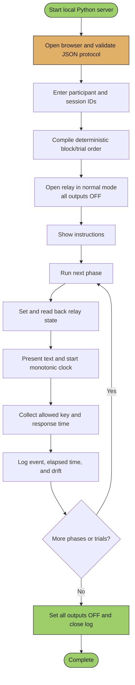

# PEBT UGM Local Web Experiment Studio

> **Local Web UI with a Python backend for replacing the OpenSesame workflow and controlling three physical lamp rows through an RLY-P4-U USB relay.**

---

## Table of Contents

- [Overview](#overview)
- [Research Protocol Status](#research-protocol-status)
- [System Architecture](#system-architecture)
- [Hardware Requirements](#hardware-requirements)
- [Software Requirements](#software-requirements)
- [Download Relay-Control Software](#download-relay-control-software--unduh-software-kontrol-relay)
- [Installation](#installation)
- [Experimental Software Setup](#experimental-software-setup--penyiapan-software-eksperimen)
- [Local Web User Interface](#local-web-user-interface--antarmuka-web-lokal)
- [Local Security and Fail-safe](#local-security-and-fail-safe)
- [Verification](#verification--verifikasi)
- [Configuration](#configuration)
- [Command-Line Usage](#command-line-usage)
- [API Reference](#api-reference)
- [Program Flow](#program-flow)
- [Relay Channel Mapping](#relay-channel-mapping)
- [Error Codes](#error-codes)
- [Troubleshooting](#troubleshooting)
- [License](#license)

---

## Overview

This project provides a configurable **local Web experiment builder and runner** for replacing the current OpenSesame workflow. Running `gui.py` starts a Python HTTP backend on `127.0.0.1` and opens the interface in the default browser. Researchers can visually create and edit block/trial/phase sequences, validate and save them as JSON, then execute the saved experiment without editing Python code. The application presents instructions and paper-style PEBT choice/wait screens, controls three physical lamp rows, collects keyboard responses and response times, and writes a structured event log plus an auditable session summary. A separate Manual/System Setup mode is retained for hardware diagnostics.

The reusable `relay_controller.py` module controls the **RLY-P4-U** 4-channel USB relay board through the vendor-supplied **Ydci.dll** and Python's `ctypes` module.

The system was developed as part of a collaborative research project at **Universitas Gadjah Mada (UGM)**.

> **Experimental software update / Pembaruan software eksperimen:** This setup uses neither OpenSesame nor Tkinter for its primary interface. The experiment is implemented directly in Python, developed/run from Visual Studio Code (VS Code), and operated through a browser-based local UI. / Setup ini tidak menggunakan OpenSesame maupun Tkinter sebagai antarmuka utama. Eksperimen dibuat langsung sebagai kode Python, dikembangkan/dijalankan melalui VS Code, dan dioperasikan melalui Web UI lokal di browser.

---

## Research Protocol Status

The experiment engine includes `configs/pebt_yamawaki_2023_draft.json`, a paper-derived implementation of the PEBT example in Yamawaki et al. (2023). It is the default Web UI configuration and implements:

- SET1 and SET2, each containing 24 choices split into 12-light and 4-light blocks;
- keyboard choice between SEST (left arrow, lights off) and DIFT (right arrow, lights on);
- multipage participant instructions and a graphical 12-bulb stimulus matching the structure of Fig. 1;
- the published DIFT waiting-time and SEST-DIFT time-difference frequencies;
- a 10-second, 12-light hardware confirmation; and
- participant assignment to the interactive-agent or non-interactive-agent condition.

The configuration remains explicitly marked `draft`, not `validated`. The paper does not completely specify the local four-lamp relay bank, exact pairing of the two randomized timing factors, translated screen copy, practice trials, or project-owned cat/Piyota/Wizard-of-Oz assets. These items require researcher confirmation and a hardware pilot before final data collection. Manual mode remains diagnostic only.

- See [Paper-to-software protocol mapping](docs/pebt-protocol-mapping.md) for the evidence table and unresolved decisions.
- `configs/demo_experiment.json` remains available only for short system tests; its timings are not research parameters.
- A configuration cannot use status `validated` unless it cites at least one `research_paper` source.
- The final protocol must also pass the review checklist in [Experiment Configuration](docs/experiment-configuration.md).

Research parameters were mapped from [Yamawaki et al. (2023)](https://doi.org/10.1016/j.jenvp.2023.101999), with the original Japanese PEBT materials used as a secondary implementation reference through the [public OSF project](https://osf.io/vxpmq/). Hardware/API behavior has been checked against the official [hardware manual](https://cdn.y2c.co.jp/ub/pdf/rly-p4_2_0b-ubt.pdf), [software manual](https://cdn.y2c.co.jp/docs/softwaremanual/ub/ub_softwaremanual.pdf), and [Y2 Python sample](https://www.y2c.co.jp/ub/ub_rlyp4/python/).

---

## System Architecture

The browser renders the bento-grid/glassmorphism workspace, but it does not own experiment timing or direct hardware access. The loopback-only Python backend validates every command, owns the monotonic experiment clock and event logger, and is the sole owner of the relay connection.

```text
Browser Web UI (Build / Execute / Manual)
  → HTTP JSON on 127.0.0.1
  → Python backend (`web_app.py`)
  → runtime, validator, planner, and logger
  → `relay_controller.py`
  → Python `ctypes`
  → vendor `Ydci.dll`
  → USB → RLY-P4-U → lamp rows
```

The Web UI consists only of local HTML, CSS, and JavaScript files served by Python. It does not use a cloud service, CDN, Node.js runtime, or external Web framework.

### Component Breakdown

| Component | Role |
|-----------|------|
| **`gui.py`** | Compatibility launcher; `python gui.py` starts the local Web server |
| **`web_app.py`** | Loopback HTTP server, static assets, JSON API, relay lease, and session ownership |
| **`web_runtime.py`** | Thread-safe timed runner, browser actions, heartbeat watchdog, and fail-safe cleanup |
| **`experiment_document.py`** | Toolkit-independent editable JSON document used by Build mode |
| **`web/`** | Browser UI (`index.html`, `styles.css`, and `app.js`) with bento-grid and glassmorphism styling |
| **`experiment.py`** | JSON validation, deterministic trial planning, and session logging |
| **`pebt.py`** | Expands compact paper-derived PEBT factors into executable trials |
| **`relay_controller.py`** | Shared wrapper around the vendor DLL plus an in-memory demo controller |
| **`main.py`** | Compatible one-shot CLI that applies the original default state |
| **`ctypes`** | Python's built-in Foreign Function Interface for calling C libraries |
| **`Ydci.dll`** | Vendor-supplied driver library loaded through `ctypes.windll` / `WinDLL` (Windows `stdcall` on 32-bit; unified Windows x64 ABI on 64-bit) |
| **RLY-P4-U** | 4-channel USB relay board with DIP-switch board ID selection |

---

## Hardware Requirements

| Item                     | Specification                              |
|--------------------------|--------------------------------------------|
| Relay Board              | **RLY-P4-U** (4-channel USB relay module)  |
| USB Port                 | USB 2.0 or higher                          |
| Power                    | USB bus-powered                            |
| Board DIP Switch         | Set to ID `0` (default)                    |

---

## Software Requirements

| Dependency | Version | Notes |
|------------|---------|-------|
| Windows OS | 10 / 11 | Required for the relay driver and `Ydci.dll` |
| Python | 3.7+ | Backend, HTTP server, experiment runtime, and `ctypes`; no pip packages |
| Modern browser | Current | Chrome, Edge, or Firefox for the local interface |
| Visual Studio Code | Current | Recommended IDE used to edit and run the experiment |
| VS Code Python extension | Current | Provides interpreter selection and Python run/debug support |
| Relay USB driver | Vendor build | Required only in hardware mode |
| `Ydci.dll` | Vendor build | Required only in hardware mode; must export `YdciOpen`, `YdciRlyOutput`, `YdciRlyOutputStatus`, and `YdciClose` |

> **Zero external Web dependencies:** The backend and Web UI use the Python standard library plus repository-owned HTML/CSS/JavaScript. No `pip install`, `npm install`, CDN, or internet connection is needed after the source code is downloaded. Demo mode also requires neither the DLL nor relay hardware.

> **Architecture requirement / Persyaratan arsitektur:** Python and `Ydci.dll` must use the same bitness (both 32-bit or both 64-bit). / Python dan `Ydci.dll` harus menggunakan arsitektur yang sama (keduanya 32-bit atau keduanya 64-bit).

---

## Download Relay-Control Software / Unduh Software Kontrol Relay

The relay-control source code is publicly available from the project repository. Choose the option that matches how you want to use it. / Source code kontrol relay tersedia secara publik melalui repository proyek. Pilih opsi sesuai kebutuhan.

| Option / Opsi | Use / Kegunaan | Link |
|---------------|----------------|------|
| Repository | View the complete project, documentation, and history / Melihat proyek, dokumentasi, dan riwayat lengkap | [Open GitHub repository](https://github.com/MarcoAlandAdinanda/PEBT_UGM) |
| ZIP package | Download the complete `main` branch without Git / Mengunduh seluruh branch `main` tanpa Git | [Download PEBT_UGM-main.zip](https://github.com/MarcoAlandAdinanda/PEBT_UGM/archive/refs/heads/main.zip) |
| `main.py` only | Download only the legacy one-shot CLI; use the repository/ZIP for the Web UI / Mengunduh hanya CLI lama; gunakan repository/ZIP untuk Web UI | [Open/download main.py](https://raw.githubusercontent.com/MarcoAlandAdinanda/PEBT_UGM/main/main.py) |

> **Important / Penting:** The repository/ZIP provides the local Web UI, Python backend, command-line tool, and relay controller. The vendor-owned `Ydci.dll` and USB driver are **not included** and must be obtained from the relay vendor or an authorized project maintainer. / Repository/ZIP menyediakan Web UI lokal, backend Python, command-line tool, dan kontrol relay. `Ydci.dll` serta driver USB milik vendor **tidak disertakan** dan harus diperoleh dari vendor relay atau pengelola proyek yang berwenang.

> **Publication note / Catatan publikasi:** These links contain the files already published on branch `main`. Commit and push this Web UI release before sending the links as a Web UI download; until that happens, the remote ZIP/repository may still contain only the earlier CLI release. / Tautan tersebut hanya memuat file yang sudah dipublikasikan pada branch `main`. Commit dan push rilis Web UI ini sebelum tautan dikirim sebagai unduhan Web UI.

---

## Installation

### 1. Get the Source Code

Clone the repository with Git:

```bash
git clone https://github.com/MarcoAlandAdinanda/PEBT_UGM.git
cd PEBT_UGM
```

Alternatively, download the [ZIP package](https://github.com/MarcoAlandAdinanda/PEBT_UGM/archive/refs/heads/main.zip), extract it, and open the extracted `PEBT_UGM-main` folder.

### 2. Run the First Local Demo

From the repository root, run:

```bash
python gui.py --demo
```

Python prints the local address and normally opens it in the default browser:

```text
PEBT UGM Web UI: http://127.0.0.1:8765/
Mode: DEMO
```

If the browser does not open, visit `http://127.0.0.1:8765/` manually. Demo mode uses an in-memory relay and is the fastest way to verify Build, Execute, Manual, logging, and the browser layout without a DLL or physical device. Stop the server with `Ctrl+C`; shutdown requests an experiment abort, commands all outputs OFF, and verifies readback. If command/readback fails in hardware mode, the process reports a safety error instead of claiming that the outputs are OFF.

### 3. Install the Ydci Driver for Hardware Mode

1. Connect the **RLY-P4-U** relay board to your PC via USB.
2. Install the vendor-supplied USB driver (typically found on the manufacturer's CD or download page).
3. Obtain the authorized `Ydci.dll` that matches your Python architecture.
4. Ensure `Ydci.dll` is accessible — place it either:
   - In the project directory beside `gui.py`, **or**
   - In a directory listed in your system `PATH`

### 4. Verify Hardware Connection

Open **Windows Device Manager** and confirm the relay board appears (it may show as `RLY-P4-U` under USB devices).

---

## Experimental Software Setup / Penyiapan Software Eksperimen

### Implementation Model / Model Implementasi

**English:** OpenSesame is not part of this setup. The experiment is implemented in Python. VS Code is the editor and launch environment; `gui.py` starts `web_app.py`, the browser displays the local interface, `web_runtime.py` owns the timed phases, `experiment.py` defines the protocol/planner/logger, and `relay_controller.py` calls `Ydci.dll`.

**Bahasa Indonesia:** OpenSesame tidak digunakan pada setup ini. Eksperimen diimplementasikan dengan Python. VS Code menjadi editor dan lingkungan eksekusi; `gui.py` menjalankan `web_app.py`, browser menampilkan interface lokal, `web_runtime.py` mengelola fase bertiming, `experiment.py` mendefinisikan protokol/planner/logger, dan `relay_controller.py` memanggil `Ydci.dll`.

```text
Browser → HTTP lokal → Python (`gui.py` / `web_app.py`) → JSON protocol → `web_runtime.py` + logger → `relay_controller.py` → `ctypes` → `Ydci.dll` → USB → RLY-P4-U
```

### Step-by-Step Quick Start / Langkah Cepat

1. Install Python 3.7 or newer, VS Code, and the Microsoft Python extension. Ensure Python and `Ydci.dll` have matching 32/64-bit architectures. / Instal Python 3.7 atau lebih baru, VS Code, dan Microsoft Python extension. Pastikan arsitektur Python dan `Ydci.dll` sama-sama 32-bit atau 64-bit.
2. Clone the repository or download and extract the ZIP package from the [download section](#download-relay-control-software--unduh-software-kontrol-relay). / Clone repository atau unduh dan ekstrak paket ZIP dari [bagian unduhan](#download-relay-control-software--unduh-software-kontrol-relay).
3. Open the `PEBT_UGM` or extracted `PEBT_UGM-main` folder in VS Code using **File → Open Folder**. / Buka folder `PEBT_UGM` atau hasil ekstraksi `PEBT_UGM-main` melalui **File → Open Folder** di VS Code.
4. Open the Command Palette (`Ctrl+Shift+P`), select **Python: Select Interpreter**, and choose the installed interpreter with the correct architecture. / Buka Command Palette (`Ctrl+Shift+P`), pilih **Python: Select Interpreter**, lalu pilih interpreter dengan arsitektur yang sesuai.
5. For a software-only check, run `python gui.py --demo`; no DLL or relay is needed. / Untuk pemeriksaan software saja, jalankan `python gui.py --demo`; DLL dan relay tidak diperlukan.
6. For hardware mode, install the vendor USB driver, then place the authorized `Ydci.dll` in the project directory beside `gui.py` (recommended) or on the Windows `PATH`. / Untuk mode hardware, instal driver USB vendor, lalu letakkan `Ydci.dll` resmi di folder proyek bersama `gui.py` (direkomendasikan) atau pada `PATH` Windows.
7. Set the RLY-P4-U DIP switch to board ID `0`, connect the relay board over USB, and verify it appears in Windows Device Manager. / Atur DIP switch RLY-P4-U ke board ID `0`, hubungkan relay melalui USB, lalu pastikan perangkat muncul di Windows Device Manager.
8. Open the VS Code integrated terminal in the project folder and start hardware mode. / Buka terminal terintegrasi VS Code pada folder proyek lalu jalankan mode hardware:

   ```bash
   python gui.py
   ```

9. The browser normally opens automatically at `http://127.0.0.1:8765/`. Keep the terminal running for the entire session. / Browser biasanya terbuka otomatis di `http://127.0.0.1:8765/`. Biarkan terminal tetap berjalan selama sesi.
10. Use **Build** to create or open an experiment. Edit the Experiment → Block → Trial → Phase tree, click **Terapkan properti**, then **Validasi** and **Simpan**. / Gunakan **Build** untuk membuat atau membuka eksperimen. Edit struktur Experiment → Block → Trial → Phase, klik **Terapkan properti**, lalu **Validasi** dan **Simpan**.
11. Click **Gunakan di Execute**, enter the participant ID and session information in **Execute**, then start the session. The default PEBT draft is for review/pilot work until the open protocol decisions are approved. / Klik **Gunakan di Execute**, isi ID partisipan dan informasi sesi pada **Execute**, lalu mulai sesi. Draft PEBT default hanya untuk review/pilot sampai keputusan protokol yang masih terbuka disetujui.
12. Use **Manual / System Setup** only to verify individual lamp rows and wiring. / Gunakan **Manual / System Setup** hanya untuk memeriksa deret lampu dan wiring.

> Applying a Web UI selection in hardware mode changes physical relay outputs. Verify the wiring and connected loads first. / Menerapkan pilihan Web UI dalam mode hardware mengubah keluaran fisik relay. Periksa wiring dan beban yang terhubung terlebih dahulu.

---

## Local Web User Interface / Antarmuka Web Lokal

The responsive browser workspace uses a bento-grid layout and restrained glassmorphism 2.0 for operator screens. The participant runner switches to a solid, distraction-free full-screen surface so visual blur and decoration do not affect the stimulus. The interface has three working modes that replace the OpenSesame authoring and execution workflow. / Workspace browser yang responsif menggunakan bento grid dan glassmorphism 2.0 untuk layar operator. Runner partisipan berubah menjadi layar solid tanpa dekorasi agar stimulus tidak dipengaruhi efek visual. Interface memiliki tiga mode yang menggantikan alur OpenSesame.

| Mode | Purpose / Kegunaan |
|------|--------------------|
| **Build** | Create, open, visually edit, validate, and save experiment JSON. / Membuat, membuka, mengedit secara visual, memvalidasi, dan menyimpan JSON eksperimen. |
| **Execute** | Select a saved configuration or builder snapshot, enter participant/session data, and run it. / Memilih konfigurasi tersimpan atau snapshot builder, mengisi data partisipan/sesi, dan menjalankannya. |
| **Manual / System Setup** | Connect the relay and test physical lamp rows; automatically locked while a session is active. / Menghubungkan relay dan mengetes deret lampu; otomatis dikunci saat sesi aktif. |

### Build an Experiment

1. Open **Build**, then choose **Eksperimen baru** or select a saved configuration and click **Buka**.
2. Select an item in the Experiment → Block → Trial → Phase tree. Add, duplicate, delete, or move items using the buttons below the tree.
3. Edit the selected item's properties and click **Terapkan properti**. Trial metadata, instruction pages, and sources accept JSON objects/arrays so protocol-specific fields remain available.
4. Click **Validasi**. Structural changes automatically return a `validated` document to `draft`, preventing an edited protocol from retaining a stale validation label.
5. Click **Simpan** to validate the schema and write a copy under `configs/user/`, then **Gunakan di Execute**. Builder snapshots can also be handed directly to Execute without changing the repository baseline files.

The compact default PEBT generator is expanded into 49 editable trials when opened in the builder. It is treated as a new draft and saved under `configs/user/`, so the compact baseline file is not overwritten accidentally. / Generator PEBT ringkas dikembangkan menjadi 49 trial yang dapat diedit ketika dibuka di builder. Hasilnya dianggap sebagai draft baru dan disimpan di `configs/user/`, sehingga file baseline ringkas tidak tertimpa tanpa sengaja.

| Web UI control | Relay channel | Physical lamp row |
|-------------|---------------|-------------------|
| **Deret Kiri** | Relay 1 | Left side / sisi kiri |
| **Deret Kanan** | Relay 2 | Right side / sisi kanan |
| **Deret Depan** | Relay 3 | Front side / sisi depan (rel hitam pada setup awal) |
| Always OFF | Relay 4 | Unused / tidak digunakan |

### Execute an Experiment

```bash
python gui.py
```

1. Open **Execute**. Use the snapshot sent from Build, or select a JSON protocol and click **Muat & validasi**. The initial default is the paper-derived PEBT draft.
2. Confirm the protocol status, sources, trial count, and estimated phase-duration range.
3. Enter a participant ID and session label, then select the assigned participant condition.
4. For a `demo` or `draft` protocol, keep **Izinkan menjalankan protokol demo/draft untuk pilot sistem** selected. This is an explicit pilot override, not scientific validation.
5. Click **Mulai eksperimen** and follow the browser runner. Instruction/block gates accept `Space`; response buttons and configured keyboard keys are both supported.
6. Press `Esc` or click **Batalkan · Esc**, then confirm, to abort safely; partial data remains available.

The Python runtime commands all outputs OFF at every phase boundary, after every trial, at completion, on abort/error, on heartbeat timeout, and when the server closes. It reads the relay state back after each command and stores requested/actual timing in the event log. A failed OFF command/readback is reported as **relay status unknown**, with a safety warning and nonzero shutdown result; the operator must then use the physical cutoff and verify the load directly. Backend monotonic timing is authoritative; browser elapsed time is recorded only as supporting detail. Each session produces a collision-safe `*.events.csv` and `*.summary.json`; the summary includes the configuration SHA-256, compiled trial order, completion status, response timing, SEST/DIFT counts by SET, and the paper's primary behavioral-change measure (`SEST SET2 - SEST SET1`). An interrupted process leaves the flushed CSV and an `in_progress` manifest for recovery.

### Manual Hardware Diagnostics

1. Open **Manual / System Setup**.
2. Click **Hubungkan relay** and confirm that readback is available.
3. Select one or more lamp rows, then click **Terapkan ke relay**.
4. Compare **Actual readback** with the requested vector.
5. Click **Matikan semua**, then **Putuskan**, after the check.

### Demo Mode (No DLL or Hardware Required)

```bash
python gui.py --demo
```

Demo mode exercises the full experiment runner and manual controls without loading `Ydci.dll` or changing physical outputs. The browser header displays **Mode simulasi** so it cannot be mistaken for a hardware session.

Additional launcher options:

```bash
python gui.py --demo --no-browser       # print the URL without opening a browser
python gui.py --demo --port 8877        # use another local port
```

Only `127.0.0.1`, `localhost`, and `::1` are accepted as bind addresses.

---

## Local Security and Fail-safe

- The server binds only to a loopback address and rejects non-local `Host` headers. It is not a LAN or internet service.
- The browser receives a fresh random control token for each Python process. Every state-changing API request must return that token in the `X-PEBT-Token` header.
- Static responses use a restrictive Content Security Policy, deny framing, disable MIME sniffing, and are not cached.
- Python owns a single experiment session and relay lease. Manual commands are rejected while an experiment is active.
- A random browser-client ID binds the active session to the tab that started it. Actions, heartbeat, dismiss, and long-poll requests from another or stale tab are rejected.
- The visible runner sends a heartbeat every two seconds. If the tab becomes hidden/disconnected and the backend receives no heartbeat for approximately 15 seconds, the session is aborted and the backend commands/reads back all channels OFF; a failure is surfaced as unknown state.
- Channel 4 is requested OFF by both Manual and experiment mappings. Closing the server with `Ctrl+C` requests abort, commands all outputs OFF, verifies readback, and closes the relay connection. If OFF cannot be verified, the UI shows unknown state and the process emits a safety error; use the physical emergency cutoff.

These controls protect a trusted local operator workflow; they are not a substitute for Windows account security, safe electrical wiring, isolation, and an accessible physical emergency cutoff.

---

## Verification / Verifikasi

Run the software checks from the repository root / Jalankan pemeriksaan software dari root repository:

```bash
python -m py_compile main.py relay_controller.py pebt.py experiment.py experiment_document.py web_runtime.py web_app.py gui.py
python -m unittest discover -s tests -v
```

If Node.js is already installed, the browser module can also be syntax-checked without installing packages:

```bash
node --check web/app.js
node --test tests/test_start_gate.mjs
```

The automated suite validates the local HTTP shell and security headers/token, builder document behavior, configuration/schema errors, deterministic randomization, browser-runtime heartbeat abort, relay interlocks/readback, session recovery/logging, both SEST/DIFT branches, the SET2-minus-SET1 measure, and an accelerated end-to-end run of all 49 trials. These checks use an in-memory relay and do not replace a physical pilot. / Suite otomatis memvalidasi HTTP lokal dan keamanan, builder, schema, randomisasi, heartbeat, interlock/readback, logging, kedua cabang relay, ukuran SET2-minus-SET1, dan dry-run 49 trial. Pemeriksaan ini menggunakan relay memori dan tidak menggantikan pilot fisik.

For the physical pilot, install the authorized `Ydci.dll` and driver, connect the board at ID `0`, confirm each bank in **Manual / System Setup**, then run the draft in hardware mode while checking readback and actual lamp timing. / Untuk pilot fisik, instal DLL/driver resmi, hubungkan board ID `0`, periksa setiap deret melalui **Manual / System Setup**, lalu jalankan draft dalam mode hardware sambil memeriksa readback dan timing lampu aktual.

> **Verification limit / Batas verifikasi:** Syntax, automated tests, demo execution, and local-browser behavior can be verified without the device. Calls to `YdciOpen`, `YdciRlyOutput`, `YdciRlyOutputStatus`, `YdciClose`, electrical wiring, fail-safe behavior, and actual light-onset timing can only be verified on Windows with the authorized driver/DLL and physical RLY-P4-U. / Sintaks, test otomatis, mode demo, dan perilaku browser lokal dapat diverifikasi tanpa perangkat. Pemanggilan DLL, wiring, fail-safe, dan timing cahaya aktual hanya dapat diverifikasi dengan hardware yang tersedia.

---

## Configuration

Hardware constants are defined in `relay_controller.py`; the original CLI default remains in `main.py`:

```python
DEVICE_NAME = b"RLY-P4/2/0B-UBT"   # Internal DLL model designation
BOARD_ID    = 0                      # Board DIP-switch ID (usually 0)
NUM_RELAYS  = 4                      # Number of relay channels
DEFAULT_RELAY_STATE = (1, 1, 1, 0)  # Original command-line default

# main.py
RELAY_STATE = DEFAULT_RELAY_STATE
```

### Configuration Parameters

| Parameter      | Type    | Default                 | Description                                          |
|----------------|---------|-------------------------|------------------------------------------------------|
| `DEVICE_NAME`  | `bytes` | `b"RLY-P4/2/0B-UBT"`   | Internal model name required by the DLL              |
| `BOARD_ID`     | `int`   | `0`                     | Board ID set via DIP switches on the hardware        |
| `NUM_RELAYS`   | `int`   | `4`                     | Total number of relay channels                       |
| `DEFAULT_RELAY_STATE` | `tuple` | `(1, 1, 1, 0)`   | Original command-line default state                 |

The Web UI starts with all rows unselected and the Python backend builds output as `(left, right, front, 0)`. This prevents lights from being energized until the operator chooses a row and applies the selection.

Experiment sequence, timing, randomization, stimuli, response keys, and source citations are stored in JSON rather than hard-coded. See the [experiment-configuration guide](docs/experiment-configuration.md), [paper-to-software mapping](docs/pebt-protocol-mapping.md), [PEBT draft configuration](configs/pebt_yamawaki_2023_draft.json), and non-research [demo configuration](configs/demo_experiment.json).

> **⚠️ Important:** The `DEVICE_NAME` must be set to `b"RLY-P4/2/0B-UBT"` — the full internal model designation. Although Windows Device Manager shows the board as `RLY-P4-U`, the DLL requires this specific string.

---

## Command-Line Usage

The original one-shot behavior remains available for compatibility. It applies `(1, 1, 1, 0)` and then closes the connection.

### Basic Execution

```bash
python main.py
```

### Expected Output (Success)

```
[OK]  Ydci DLL loaded successfully.
Open  : code=0, dev_id=0
Relay : code=0, states=[1, 1, 1, 0]
[OK]  Relay states applied successfully.
Close : success=True

Done.
```

### Modifying Relay States

Edit the `RELAY_STATE` tuple in `main.py` to control individual channels:

```python
# Example: Turn ON only Channel 1 and Channel 3
RELAY_STATE = (1, 0, 1, 0)

# Example: Turn OFF all channels
RELAY_STATE = (0, 0, 0, 0)

# Example: Turn ON all three connected lamp rows (Relay 4 remains unused)
RELAY_STATE = (1, 1, 1, 0)
```

---

## API Reference

`RelayController` interfaces with three core DLL functions via `ctypes`:

### `YdciOpen`

Opens a connection to the relay board.

```
int YdciOpen(unsigned short boardSwitch, char* modelName, unsigned short* id, unsigned short mode)
```

| Parameter   | Type       | Description                              |
|-------------|------------|------------------------------------------|
| `boardSwitch` | `c_ushort` | Board ID from DIP-switch (`0` to `15`) |
| `modelName` | `c_char_p` | Internal model name as a byte string     |
| `id`        | `*c_ushort` | Output - receives the device handle ID  |
| `mode`      | `c_ushort` | `0` opens and turns all outputs OFF; `1` preserves state |
| **Returns** | `c_int`    | `0` on success, error code otherwise     |

---

### `YdciRlyOutput`

Sets the ON/OFF state of one or more relay channels.

```
int YdciRlyOutput(unsigned short id, ubyte* data, unsigned short offset, unsigned short count)
```

| Parameter   | Type        | Description                                   |
|-------------|-------------|-----------------------------------------------|
| `id`        | `c_ushort`  | Device handle returned by `YdciOpen`          |
| `data`      | `*c_ubyte`  | Relay states (`0` = OFF, `1` = ON, `2` = hold) |
| `offset`    | `c_ushort`  | Starting channel index (usually `0`)          |
| `count`     | `c_ushort`  | Number of channels to set                     |
| **Returns** | `c_int`     | `0` on success, error code otherwise          |

---

### `YdciClose`

Closes the connection to the relay board.

```
bool YdciClose(unsigned short id)
```

| Parameter   | Type      | Description                            |
|-------------|-----------|----------------------------------------|
| `id`        | `c_ushort` | Device handle returned by `YdciOpen` |
| **Returns** | `c_int`    | Nonzero (`TRUE`) on success; `0` on failure |

---

## Program Flow

The following diagram illustrates the Web execution flow. Browser events request actions; Python remains responsible for validation, relay ownership, timing, and logging:



### Execution Stages

| Stage | Component | Description |
|-------|-----------|-------------|
| 1 | `ExperimentConfig` | Validate protocol status, sources, blocks, trials, phases, and responses |
| 2 | `compile_trials` | Build deterministic participant-specific trial order |
| 3 | `WebExperimentSession` | Schedule phases with a backend monotonic clock and accept validated browser actions |
| 4 | `RelayController` | Exclusively apply and read back `(left, right, front, 0)` |
| 5 | `ExperimentLogger` | Flush event CSV rows and atomically write a reproducibility summary |
| 6 | Runtime cleanup/watchdog | Turn all channels off on completion, abort, error, heartbeat timeout, or server shutdown |

---

## Relay Channel Mapping

The current hardware wiring maps relay channels to physical connections as follows:

```
 ┌────────────────────────────────────────────────────────┐
 │                  RLY-P4-U Relay Board                  │
 ├──────────┬──────────────────────┬──────────────────────┤
 │ Channel  │ Connected Device     │ CLI Default State    │
 ├──────────┼──────────────────────┼──────────────────────┤
 │ Relay 1  │ Rel Putih Kiri       │ ON  (1)              │
 │ Relay 2  │ Rel Putih Kanan      │ ON  (1)              │
 │ Relay 3  │ Deret Depan/Rel Hitam│ ON  (1)              │
 │ Relay 4  │ (Unassigned)         │ OFF (0)              │
 └──────────┴──────────────────────┴──────────────────────┘
```

> **Translation:** "Rel Putih Kiri" = left lamp row, "Rel Putih Kanan" = right lamp row, and the original "Rel Hitam" is presented in the Web UI as the front lamp row.

> **📌 Research Note:** The setup contains three independently controlled lamp rows. Relay 4 is not connected and every experiment mapping requests it OFF. Startup commands/readback verify all outputs OFF; `(1, 1, 1, 0)` is retained only as the legacy CLI default.

---

## Error Codes

| Return Code | Meaning                                               |
|-------------|-------------------------------------------------------|
| `0`         | Success                                               |
| Non-zero    | Error — check hex representation for DLL-specific info|

The table above applies to `YdciOpen`, `YdciRlyOutput`, and status-read functions. `YdciClose` is different: it returns nonzero (`TRUE`) on success and `0` (`FALSE`) on failure.

The script displays error codes in both decimal and hexadecimal format for easier debugging:

```python
raise RelayConnectionError(result_open)
```

---

## Troubleshooting

### DLL Loading Fails

```
[FAIL] Could not load Ydci DLL: ...
```

| Possible Cause                | Solution                                                   |
|-------------------------------|------------------------------------------------------------|
| `Ydci.dll` not found          | Place the DLL in the same directory as `main.py`           |
| Missing VC++ runtime          | Install the Visual C++ Redistributable for your system     |
| 32/64-bit mismatch            | Ensure Python and DLL bit-depth match (both x86 or x64)    |

### Device Open Fails

```
[FAIL] YdciOpen error ...
```

| Possible Cause                | Solution                                                   |
|-------------------------------|------------------------------------------------------------|
| USB cable disconnected        | Check physical USB connection                              |
| Wrong `DEVICE_NAME`           | Use `b"RLY-P4/2/0B-UBT"` (not the Device Manager name)   |
| Driver not installed          | Install the vendor USB driver                              |
| Board ID mismatch             | Check DIP-switch setting matches `BOARD_ID`                |

### Relay Output Fails

```
[WARN] YdciRlyOutput error ...
```

| Possible Cause                | Solution                                                   |
|-------------------------------|------------------------------------------------------------|
| Invalid device handle         | Ensure `YdciOpen` returned code `0`                        |
| Array size mismatch           | Verify `NUM_RELAYS` matches the physical channel count     |

### Web UI Opens but Cannot Connect to the Relay

| Possible Cause | Solution |
|----------------|----------|
| Testing without hardware | Run `python gui.py --demo` |
| DLL or driver unavailable | Install the authorized vendor files and restart the Python server |
| Wrong interpreter selected | Select a Python interpreter with the same bitness as `Ydci.dll` |

### Browser Does Not Open or Page Does Not Load

| Possible Cause | Solution |
|----------------|----------|
| Automatic browser launch is blocked | Open the exact URL printed in the terminal, normally `http://127.0.0.1:8765/` |
| Port `8765` is in use | Run `python gui.py --demo --port 8877` (or another unused port) |
| Python terminal was closed | Start `gui.py` again and keep its terminal running |
| Trying to open the page from another computer | The application is intentionally localhost-only; use the same PC that runs Python |
| Runner aborts after changing tabs | Keep the experiment tab visible; loss of heartbeat intentionally triggers fail-safe abort |

### Experiment Configuration Is Rejected

| Possible Cause | Solution |
|----------------|----------|
| JSON syntax error | Use the reported line/column to correct the file |
| Invalid side, key, duration, or duplicate trial ID | Compare the file with `configs/demo_experiment.json` |
| `validated` without a paper source | Add the approved paper to `sources` with `source_type: "research_paper"` |
| PEBT draft is not yet approved | Review `docs/pebt-protocol-mapping.md`, confirm every open decision, pilot the hardware, and retain status `draft` until approval |

### Builder Changes Are Not Visible in Execute

Click **Terapkan properti**, validate the document, save it, and then click **Gunakan di Execute**. The handoff uses a validated builder snapshot. Saved builder files are written under `configs/user/`; the compact generator baseline is never overwritten directly.

---

## Project Structure

```
PEBT_UGM/
├── gui.py                    # Compatibility launcher for the local Web UI
├── web_app.py                # Loopback HTTP server, JSON API, and relay/session owner
├── web_runtime.py            # Thread-safe experiment runtime and heartbeat fail-safe
├── experiment_document.py    # Toolkit-independent builder document
├── experiment.py             # Protocol schema, planner, and session logger
├── pebt.py                   # Paper-derived PEBT protocol generator
├── relay_controller.py       # Reusable Ydci hardware interface
├── main.py                   # Compatible one-shot CLI
├── web/
│   ├── index.html            # Accessible Build/Execute/Manual shell
│   ├── styles.css            # Bento grid and glassmorphism 2.0 presentation
│   ├── start_gate.mjs        # Exclusive rapid-start interlock
│   └── app.js                # Browser state, rendering, and local API client
├── configs/
│   ├── pebt_yamawaki_2023_draft.json  # Paper-derived review/pilot draft
│   ├── demo_experiment.json           # Non-research system test only
│   └── user/                           # Configurations saved from Build
├── tests/
│   ├── test_experiment.py
│   ├── test_experiment_builder.py
│   ├── test_experiment_ui.py
│   ├── test_pebt.py
│   ├── test_relay_controller.py
│   ├── test_web_app.py
│   └── test_start_gate.mjs
├── README.md
└── docs/
    ├── architecture.png
    ├── client-response-id.md
    ├── experiment-configuration.md
    ├── local-web-ui.md
    └── pebt-protocol-mapping.md
```

---

## License

This project is part of a research collaboration at **Universitas Gadjah Mada (UGM)**. Please contact the project maintainers for licensing information.

---

<p align="center">
  <sub>Built with 🐍 Python &bull; Universitas Gadjah Mada</sub>
</p>
